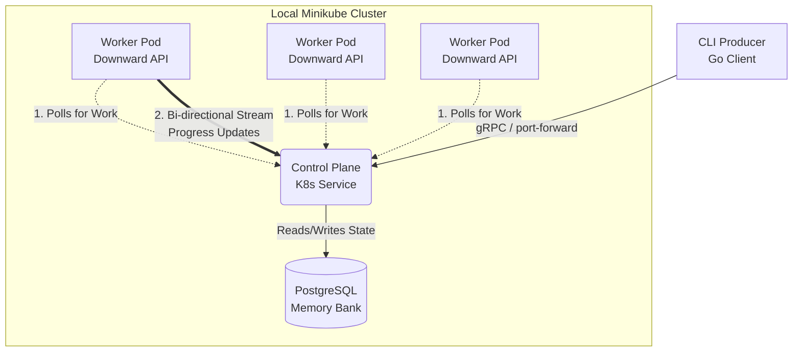

# Gopher-Queue: Distributed Task Orchestrator

A high-performance, distributed task execution engine built to bridge low-level systems architecture with modern cloud-native orchestration. Originally conceived as a transition from C++/Systems engineering to Golang/Infrastructure, this project mimics the high-throughput simulation and telemetry pipelines used in autonomous vehicle and robotics environments. 

It implements a scalable control plane that manages containerized worker pools, ensuring fault-tolerant task execution.

## Architecture
The system is designed around a decoupled Producer-Consumer model, utilizing gRPC for strict contracts and low-latency communication across the Kubernetes network.
* **Control Plane:** A gRPC server that acts as the "Brain," maintaining a thread-safe state machine of all tasks in the system.
* **Workers:** Stateless, containerized Go binaries that pull tasks, execute workload logic, and report status via gRPC streams.
* **Persistence Layer:** A normalized relational schema in PostgreSQL to ensure task data survives Control Plane restarts.

<!-- 

-->

## The Stack
* **Language:** Golang.
* **Communication:** gRPC and Protocol Buffers for inter-service communication.
* **Orchestration:** Kubernetes (K8s) to manage worker lifecycles, self-healing, and dynamic scaling.
* **Persistence:** PostgreSQL for task metadata persistence and fault-tolerant state tracking.

## Project Goals & Features
* **Distributed Task Scheduling:** A centralized Control Plane distributes computational tasks to a pool of polling, heartbeating Workers.
* **Cloud-Native Scalability:** Stateless worker deployments allow for instant scaling based on queue depth.
* **Fault Tolerance:** If a worker disconnects or fails mid-task, the unacknowledged task remains safely in the database for reassignment (At-least-once delivery).
* **Performance Optimization:** Granular, real-time logging tracking exact K8s Pods by name as they transition tasks through states.

## Quick Start Guide
1. Start the Local Cloud
```
minikube start --driver=docker
eval $(minikube docker-env)
```
2. Build the Containers
```
docker build -t gopher-control:v1 -f cmd/control-plane/Dockerfile .
docker build -t gopher-worker:v1 -f cmd/worker/Dockerfile .
```
3. Deploy the Infrastructure
```
kubectl apply -f ./deployments/
```
4. Open the Bridge & Watch the logs
Open two new terminal windows:
- Terminal A: `kubectl port-forward svc/gopher-control 50051:50051`
- Terminal B: `kubectl logs -l app=gopher-control -f`
5. Inject a Task
Use the CLI producer to submit a simulation payload:
```
go run cmd/cli/main.go --type="Simulation" --priority=10 --payload="sensor-telemetry-v1"
```

## Roadmap

* [x] **Phase 1:** Define gRPC Service and implement Go Client/Server communication.
* [x] **Phase 2:** Integrate PostgreSQL for persistent task state and history.
* [x] **Phase 3:** Containerize components and deploy to a local Minikube cluster.
* [x] **Phase 4:** Build the CLI Producer and integrate the K8s Downward API for worker tracing.
* [ ] **Phase 5:** Implement Horizontal Pod Autoscaling (HPA) to dynamically scale workers based on active database queue depth.
* [ ] **Phase 6:** Terraform scripts for automated cloud provisioning (AWS/GCP).
